# Marketing Analytics

This is Exploratory Data Analysis on the marketing campaign data. <br>
Things we are going to cover here:
* Data Exploration
* Data Cleaning
* Feature Engineering 
* Exploratory Data Analysis

First we will import the libraries that we will need


```python
import pandas as pd
import matplotlib.pyplot as plt
import seaborn as sns
import numpy as np
```

reading the csv file into a dataset


```python
df = pd.read_csv("marketing_data.csv")
```

### Data Exploration
Lets check first few columns how the data looks!


```python
df.head()
```


<div>
<style scoped>
    .dataframe tbody tr th:only-of-type {
        vertical-align: middle;
    }

    .dataframe tbody tr th {
        vertical-align: top;
    }

    .dataframe thead th {
        text-align: right;
    }
</style>
<table border="1" class="dataframe">
  <thead>
    <tr style="text-align: right;">
      <th></th>
      <th>ID</th>
      <th>Year_Birth</th>
      <th>Education</th>
      <th>Marital_Status</th>
      <th>Income</th>
      <th>Kidhome</th>
      <th>Teenhome</th>
      <th>Dt_Customer</th>
      <th>Recency</th>
      <th>MntWines</th>
      <th>...</th>
      <th>NumStorePurchases</th>
      <th>NumWebVisitsMonth</th>
      <th>AcceptedCmp3</th>
      <th>AcceptedCmp4</th>
      <th>AcceptedCmp5</th>
      <th>AcceptedCmp1</th>
      <th>AcceptedCmp2</th>
      <th>Response</th>
      <th>Complain</th>
      <th>Country</th>
    </tr>
  </thead>
  <tbody>
    <tr>
      <th>0</th>
      <td>1826</td>
      <td>1970</td>
      <td>Graduation</td>
      <td>Divorced</td>
      <td>$84,835.00</td>
      <td>0</td>
      <td>0</td>
      <td>6/16/14</td>
      <td>0</td>
      <td>189</td>
      <td>...</td>
      <td>6</td>
      <td>1</td>
      <td>0</td>
      <td>0</td>
      <td>0</td>
      <td>0</td>
      <td>0</td>
      <td>1</td>
      <td>0</td>
      <td>SP</td>
    </tr>
    <tr>
      <th>1</th>
      <td>1</td>
      <td>1961</td>
      <td>Graduation</td>
      <td>Single</td>
      <td>$57,091.00</td>
      <td>0</td>
      <td>0</td>
      <td>6/15/14</td>
      <td>0</td>
      <td>464</td>
      <td>...</td>
      <td>7</td>
      <td>5</td>
      <td>0</td>
      <td>0</td>
      <td>0</td>
      <td>0</td>
      <td>1</td>
      <td>1</td>
      <td>0</td>
      <td>CA</td>
    </tr>
    <tr>
      <th>2</th>
      <td>10476</td>
      <td>1958</td>
      <td>Graduation</td>
      <td>Married</td>
      <td>$67,267.00</td>
      <td>0</td>
      <td>1</td>
      <td>5/13/14</td>
      <td>0</td>
      <td>134</td>
      <td>...</td>
      <td>5</td>
      <td>2</td>
      <td>0</td>
      <td>0</td>
      <td>0</td>
      <td>0</td>
      <td>0</td>
      <td>0</td>
      <td>0</td>
      <td>US</td>
    </tr>
    <tr>
      <th>3</th>
      <td>1386</td>
      <td>1967</td>
      <td>Graduation</td>
      <td>Together</td>
      <td>$32,474.00</td>
      <td>1</td>
      <td>1</td>
      <td>5/11/14</td>
      <td>0</td>
      <td>10</td>
      <td>...</td>
      <td>2</td>
      <td>7</td>
      <td>0</td>
      <td>0</td>
      <td>0</td>
      <td>0</td>
      <td>0</td>
      <td>0</td>
      <td>0</td>
      <td>AUS</td>
    </tr>
    <tr>
      <th>4</th>
      <td>5371</td>
      <td>1989</td>
      <td>Graduation</td>
      <td>Single</td>
      <td>$21,474.00</td>
      <td>1</td>
      <td>0</td>
      <td>4/8/14</td>
      <td>0</td>
      <td>6</td>
      <td>...</td>
      <td>2</td>
      <td>7</td>
      <td>1</td>
      <td>0</td>
      <td>0</td>
      <td>0</td>
      <td>0</td>
      <td>1</td>
      <td>0</td>
      <td>SP</td>
    </tr>
  </tbody>
</table>
<p>5 rows × 28 columns</p>
</div>


Viewing the dataset Info


```python
df.info()
```

    <class 'pandas.core.frame.DataFrame'>
    RangeIndex: 2240 entries, 0 to 2239
    Data columns (total 28 columns):
     #   Column               Non-Null Count  Dtype 
    ---  ------               --------------  ----- 
     0   ID                   2240 non-null   int64 
     1   Year_Birth           2240 non-null   int64 
     2   Education            2240 non-null   object
     3   Marital_Status       2240 non-null   object
     4    Income              2216 non-null   object
     5   Kidhome              2240 non-null   int64 
     6   Teenhome             2240 non-null   int64 
     7   Dt_Customer          2240 non-null   object
     8   Recency              2240 non-null   int64 
     9   MntWines             2240 non-null   int64 
     10  MntFruits            2240 non-null   int64 
     11  MntMeatProducts      2240 non-null   int64 
     12  MntFishProducts      2240 non-null   int64 
     13  MntSweetProducts     2240 non-null   int64 
     14  MntGoldProds         2240 non-null   int64 
     15  NumDealsPurchases    2240 non-null   int64 
     16  NumWebPurchases      2240 non-null   int64 
     17  NumCatalogPurchases  2240 non-null   int64 
     18  NumStorePurchases    2240 non-null   int64 
     19  NumWebVisitsMonth    2240 non-null   int64 
     20  AcceptedCmp3         2240 non-null   int64 
     21  AcceptedCmp4         2240 non-null   int64 
     22  AcceptedCmp5         2240 non-null   int64 
     23  AcceptedCmp1         2240 non-null   int64 
     24  AcceptedCmp2         2240 non-null   int64 
     25  Response             2240 non-null   int64 
     26  Complain             2240 non-null   int64 
     27  Country              2240 non-null   object
    dtypes: int64(23), object(5)
    memory usage: 490.1+ KB
    


```python
df['Kidhome'].unique()
```


    array([0, 1, 2], dtype=int64)


### Data Cleaning
before performing any analysis on the data, lets do some data cleaning.
first we will check if data contains any null values.


```python
df.isnull().sum()
```


    ID                      0
    Year_Birth              0
    Education               0
    Marital_Status          0
     Income                24
    Kidhome                 0
    Teenhome                0
    Dt_Customer             0
    Recency                 0
    MntWines                0
    MntFruits               0
    MntMeatProducts         0
    MntFishProducts         0
    MntSweetProducts        0
    MntGoldProds            0
    NumDealsPurchases       0
    NumWebPurchases         0
    NumCatalogPurchases     0
    NumStorePurchases       0
    NumWebVisitsMonth       0
    AcceptedCmp3            0
    AcceptedCmp4            0
    AcceptedCmp5            0
    AcceptedCmp1            0
    AcceptedCmp2            0
    Response                0
    Complain                0
    Country                 0
    dtype: int64


```python
df[df[' Income '].isna() == True]
```


<div>
<style scoped>
    .dataframe tbody tr th:only-of-type {
        vertical-align: middle;
    }

    .dataframe tbody tr th {
        vertical-align: top;
    }

    .dataframe thead th {
        text-align: right;
    }
</style>
<table border="1" class="dataframe">
  <thead>
    <tr style="text-align: right;">
      <th></th>
      <th>ID</th>
      <th>Year_Birth</th>
      <th>Education</th>
      <th>Marital_Status</th>
      <th>Income</th>
      <th>Kidhome</th>
      <th>Teenhome</th>
      <th>Dt_Customer</th>
      <th>Recency</th>
      <th>MntWines</th>
      <th>...</th>
      <th>NumStorePurchases</th>
      <th>NumWebVisitsMonth</th>
      <th>AcceptedCmp3</th>
      <th>AcceptedCmp4</th>
      <th>AcceptedCmp5</th>
      <th>AcceptedCmp1</th>
      <th>AcceptedCmp2</th>
      <th>Response</th>
      <th>Complain</th>
      <th>Country</th>
    </tr>
  </thead>
  <tbody>
    <tr>
      <th>134</th>
      <td>8996</td>
      <td>1957</td>
      <td>PhD</td>
      <td>Married</td>
      <td>NaN</td>
      <td>2</td>
      <td>1</td>
      <td>11/19/12</td>
      <td>4</td>
      <td>230</td>
      <td>...</td>
      <td>8</td>
      <td>9</td>
      <td>0</td>
      <td>0</td>
      <td>0</td>
      <td>0</td>
      <td>0</td>
      <td>0</td>
      <td>0</td>
      <td>GER</td>
    </tr>
    <tr>
      <th>262</th>
      <td>1994</td>
      <td>1983</td>
      <td>Graduation</td>
      <td>Married</td>
      <td>NaN</td>
      <td>1</td>
      <td>0</td>
      <td>11/15/13</td>
      <td>11</td>
      <td>5</td>
      <td>...</td>
      <td>2</td>
      <td>7</td>
      <td>0</td>
      <td>0</td>
      <td>0</td>
      <td>0</td>
      <td>0</td>
      <td>0</td>
      <td>0</td>
      <td>US</td>
    </tr>
    <tr>
      <th>394</th>
      <td>3769</td>
      <td>1972</td>
      <td>PhD</td>
      <td>Together</td>
      <td>NaN</td>
      <td>1</td>
      <td>0</td>
      <td>3/2/14</td>
      <td>17</td>
      <td>25</td>
      <td>...</td>
      <td>3</td>
      <td>7</td>
      <td>0</td>
      <td>0</td>
      <td>0</td>
      <td>0</td>
      <td>0</td>
      <td>0</td>
      <td>0</td>
      <td>AUS</td>
    </tr>
    <tr>
      <th>449</th>
      <td>5255</td>
      <td>1986</td>
      <td>Graduation</td>
      <td>Single</td>
      <td>NaN</td>
      <td>1</td>
      <td>0</td>
      <td>2/20/13</td>
      <td>19</td>
      <td>5</td>
      <td>...</td>
      <td>0</td>
      <td>1</td>
      <td>0</td>
      <td>0</td>
      <td>0</td>
      <td>0</td>
      <td>0</td>
      <td>0</td>
      <td>0</td>
      <td>AUS</td>
    </tr>
    <tr>
      <th>525</th>
      <td>8268</td>
      <td>1961</td>
      <td>PhD</td>
      <td>Married</td>
      <td>NaN</td>
      <td>0</td>
      <td>1</td>
      <td>7/11/13</td>
      <td>23</td>
      <td>352</td>
      <td>...</td>
      <td>7</td>
      <td>6</td>
      <td>0</td>
      <td>0</td>
      <td>0</td>
      <td>0</td>
      <td>0</td>
      <td>0</td>
      <td>0</td>
      <td>CA</td>
    </tr>
    <tr>
      <th>590</th>
      <td>10629</td>
      <td>1973</td>
      <td>2n Cycle</td>
      <td>Married</td>
      <td>NaN</td>
      <td>1</td>
      <td>0</td>
      <td>9/14/12</td>
      <td>25</td>
      <td>25</td>
      <td>...</td>
      <td>3</td>
      <td>8</td>
      <td>0</td>
      <td>0</td>
      <td>0</td>
      <td>0</td>
      <td>0</td>
      <td>0</td>
      <td>0</td>
      <td>GER</td>
    </tr>
    <tr>
      <th>899</th>
      <td>10475</td>
      <td>1970</td>
      <td>Master</td>
      <td>Together</td>
      <td>NaN</td>
      <td>0</td>
      <td>1</td>
      <td>4/1/13</td>
      <td>39</td>
      <td>187</td>
      <td>...</td>
      <td>6</td>
      <td>5</td>
      <td>0</td>
      <td>0</td>
      <td>0</td>
      <td>0</td>
      <td>0</td>
      <td>0</td>
      <td>0</td>
      <td>US</td>
    </tr>
    <tr>
      <th>997</th>
      <td>9235</td>
      <td>1957</td>
      <td>Graduation</td>
      <td>Single</td>
      <td>NaN</td>
      <td>1</td>
      <td>1</td>
      <td>5/27/14</td>
      <td>45</td>
      <td>7</td>
      <td>...</td>
      <td>2</td>
      <td>7</td>
      <td>0</td>
      <td>0</td>
      <td>0</td>
      <td>0</td>
      <td>0</td>
      <td>0</td>
      <td>0</td>
      <td>GER</td>
    </tr>
    <tr>
      <th>1096</th>
      <td>4345</td>
      <td>1964</td>
      <td>2n Cycle</td>
      <td>Single</td>
      <td>NaN</td>
      <td>1</td>
      <td>1</td>
      <td>1/12/14</td>
      <td>49</td>
      <td>5</td>
      <td>...</td>
      <td>2</td>
      <td>7</td>
      <td>0</td>
      <td>0</td>
      <td>0</td>
      <td>0</td>
      <td>0</td>
      <td>0</td>
      <td>0</td>
      <td>AUS</td>
    </tr>
    <tr>
      <th>1185</th>
      <td>7187</td>
      <td>1969</td>
      <td>Master</td>
      <td>Together</td>
      <td>NaN</td>
      <td>1</td>
      <td>1</td>
      <td>5/18/13</td>
      <td>52</td>
      <td>375</td>
      <td>...</td>
      <td>4</td>
      <td>3</td>
      <td>0</td>
      <td>0</td>
      <td>0</td>
      <td>0</td>
      <td>0</td>
      <td>0</td>
      <td>0</td>
      <td>AUS</td>
    </tr>
    <tr>
      <th>1213</th>
      <td>8720</td>
      <td>1978</td>
      <td>2n Cycle</td>
      <td>Together</td>
      <td>NaN</td>
      <td>0</td>
      <td>0</td>
      <td>8/12/12</td>
      <td>53</td>
      <td>32</td>
      <td>...</td>
      <td>1</td>
      <td>0</td>
      <td>0</td>
      <td>1</td>
      <td>0</td>
      <td>0</td>
      <td>0</td>
      <td>0</td>
      <td>0</td>
      <td>IND</td>
    </tr>
    <tr>
      <th>1312</th>
      <td>8557</td>
      <td>1982</td>
      <td>Graduation</td>
      <td>Single</td>
      <td>NaN</td>
      <td>1</td>
      <td>0</td>
      <td>6/17/13</td>
      <td>57</td>
      <td>11</td>
      <td>...</td>
      <td>3</td>
      <td>6</td>
      <td>0</td>
      <td>0</td>
      <td>0</td>
      <td>0</td>
      <td>0</td>
      <td>0</td>
      <td>0</td>
      <td>AUS</td>
    </tr>
    <tr>
      <th>1515</th>
      <td>2863</td>
      <td>1970</td>
      <td>Graduation</td>
      <td>Single</td>
      <td>NaN</td>
      <td>1</td>
      <td>2</td>
      <td>8/23/13</td>
      <td>67</td>
      <td>738</td>
      <td>...</td>
      <td>10</td>
      <td>7</td>
      <td>0</td>
      <td>1</td>
      <td>0</td>
      <td>1</td>
      <td>0</td>
      <td>0</td>
      <td>0</td>
      <td>SP</td>
    </tr>
    <tr>
      <th>1558</th>
      <td>2437</td>
      <td>1989</td>
      <td>Graduation</td>
      <td>Married</td>
      <td>NaN</td>
      <td>0</td>
      <td>0</td>
      <td>6/3/13</td>
      <td>69</td>
      <td>861</td>
      <td>...</td>
      <td>12</td>
      <td>3</td>
      <td>0</td>
      <td>1</td>
      <td>0</td>
      <td>1</td>
      <td>0</td>
      <td>0</td>
      <td>0</td>
      <td>SP</td>
    </tr>
    <tr>
      <th>1693</th>
      <td>5250</td>
      <td>1943</td>
      <td>Master</td>
      <td>Widow</td>
      <td>NaN</td>
      <td>0</td>
      <td>0</td>
      <td>10/30/13</td>
      <td>75</td>
      <td>532</td>
      <td>...</td>
      <td>11</td>
      <td>1</td>
      <td>0</td>
      <td>0</td>
      <td>1</td>
      <td>0</td>
      <td>0</td>
      <td>1</td>
      <td>0</td>
      <td>AUS</td>
    </tr>
    <tr>
      <th>1804</th>
      <td>7281</td>
      <td>1959</td>
      <td>PhD</td>
      <td>Single</td>
      <td>NaN</td>
      <td>0</td>
      <td>0</td>
      <td>11/5/13</td>
      <td>80</td>
      <td>81</td>
      <td>...</td>
      <td>4</td>
      <td>2</td>
      <td>0</td>
      <td>0</td>
      <td>0</td>
      <td>0</td>
      <td>0</td>
      <td>0</td>
      <td>0</td>
      <td>AUS</td>
    </tr>
    <tr>
      <th>1858</th>
      <td>1612</td>
      <td>1981</td>
      <td>PhD</td>
      <td>Single</td>
      <td>NaN</td>
      <td>1</td>
      <td>0</td>
      <td>5/31/13</td>
      <td>82</td>
      <td>23</td>
      <td>...</td>
      <td>3</td>
      <td>6</td>
      <td>0</td>
      <td>0</td>
      <td>0</td>
      <td>0</td>
      <td>0</td>
      <td>0</td>
      <td>0</td>
      <td>AUS</td>
    </tr>
    <tr>
      <th>1863</th>
      <td>5079</td>
      <td>1971</td>
      <td>Graduation</td>
      <td>Married</td>
      <td>NaN</td>
      <td>1</td>
      <td>1</td>
      <td>3/3/13</td>
      <td>82</td>
      <td>71</td>
      <td>...</td>
      <td>3</td>
      <td>8</td>
      <td>0</td>
      <td>0</td>
      <td>0</td>
      <td>0</td>
      <td>0</td>
      <td>0</td>
      <td>0</td>
      <td>AUS</td>
    </tr>
    <tr>
      <th>1880</th>
      <td>10339</td>
      <td>1954</td>
      <td>Master</td>
      <td>Together</td>
      <td>NaN</td>
      <td>0</td>
      <td>1</td>
      <td>6/23/13</td>
      <td>83</td>
      <td>161</td>
      <td>...</td>
      <td>4</td>
      <td>6</td>
      <td>0</td>
      <td>0</td>
      <td>0</td>
      <td>0</td>
      <td>0</td>
      <td>0</td>
      <td>0</td>
      <td>AUS</td>
    </tr>
    <tr>
      <th>1967</th>
      <td>5798</td>
      <td>1973</td>
      <td>Master</td>
      <td>Together</td>
      <td>NaN</td>
      <td>0</td>
      <td>0</td>
      <td>11/23/13</td>
      <td>87</td>
      <td>445</td>
      <td>...</td>
      <td>8</td>
      <td>1</td>
      <td>0</td>
      <td>0</td>
      <td>0</td>
      <td>0</td>
      <td>0</td>
      <td>0</td>
      <td>0</td>
      <td>GER</td>
    </tr>
    <tr>
      <th>1983</th>
      <td>2902</td>
      <td>1958</td>
      <td>Graduation</td>
      <td>Together</td>
      <td>NaN</td>
      <td>1</td>
      <td>1</td>
      <td>9/3/12</td>
      <td>87</td>
      <td>19</td>
      <td>...</td>
      <td>3</td>
      <td>5</td>
      <td>0</td>
      <td>0</td>
      <td>0</td>
      <td>0</td>
      <td>0</td>
      <td>0</td>
      <td>0</td>
      <td>AUS</td>
    </tr>
    <tr>
      <th>2139</th>
      <td>3117</td>
      <td>1955</td>
      <td>Graduation</td>
      <td>Single</td>
      <td>NaN</td>
      <td>0</td>
      <td>1</td>
      <td>10/18/13</td>
      <td>95</td>
      <td>264</td>
      <td>...</td>
      <td>5</td>
      <td>7</td>
      <td>0</td>
      <td>0</td>
      <td>0</td>
      <td>0</td>
      <td>0</td>
      <td>0</td>
      <td>0</td>
      <td>AUS</td>
    </tr>
    <tr>
      <th>2165</th>
      <td>7244</td>
      <td>1951</td>
      <td>Graduation</td>
      <td>Single</td>
      <td>NaN</td>
      <td>2</td>
      <td>1</td>
      <td>1/1/14</td>
      <td>96</td>
      <td>48</td>
      <td>...</td>
      <td>4</td>
      <td>6</td>
      <td>0</td>
      <td>0</td>
      <td>0</td>
      <td>0</td>
      <td>0</td>
      <td>0</td>
      <td>0</td>
      <td>AUS</td>
    </tr>
    <tr>
      <th>2170</th>
      <td>1295</td>
      <td>1963</td>
      <td>Graduation</td>
      <td>Married</td>
      <td>NaN</td>
      <td>0</td>
      <td>1</td>
      <td>8/11/13</td>
      <td>96</td>
      <td>231</td>
      <td>...</td>
      <td>7</td>
      <td>4</td>
      <td>0</td>
      <td>0</td>
      <td>0</td>
      <td>0</td>
      <td>0</td>
      <td>0</td>
      <td>0</td>
      <td>CA</td>
    </tr>
  </tbody>
</table>
<p>24 rows × 28 columns</p>
</div>


```python
df['Income'][0]
```


    84835.0


```python
df.columns = df.columns.str.replace(' ', '')

# transform Income column to a numerical
df['Income'] = df['Income'].str.replace('$', '')
df['Income'] = df['Income'].str.replace(',', '').astype('float')
```

    <ipython-input-13-e01b9e40f0ea>:4: FutureWarning: The default value of regex will change from True to False in a future version. In addition, single character regular expressions will*not* be treated as literal strings when regex=True.
      df['Income'] = df['Income'].str.replace('$', '')
    

* The cleaned Dataset


```python
df.head()
```

### Handelling Null Values
Strategies
* Drop Values
* Impute Mean / Median
* Custom imputaions


```python
df[df['Income'].isna() == True]
```


<div>
<style scoped>
    .dataframe tbody tr th:only-of-type {
        vertical-align: middle;
    }

    .dataframe tbody tr th {
        vertical-align: top;
    }

    .dataframe thead th {
        text-align: right;
    }
</style>
<table border="1" class="dataframe">
  <thead>
    <tr style="text-align: right;">
      <th></th>
      <th>ID</th>
      <th>Year_Birth</th>
      <th>Education</th>
      <th>Marital_Status</th>
      <th>Income</th>
      <th>Kidhome</th>
      <th>Teenhome</th>
      <th>Dt_Customer</th>
      <th>Recency</th>
      <th>MntWines</th>
      <th>...</th>
      <th>NumStorePurchases</th>
      <th>NumWebVisitsMonth</th>
      <th>AcceptedCmp3</th>
      <th>AcceptedCmp4</th>
      <th>AcceptedCmp5</th>
      <th>AcceptedCmp1</th>
      <th>AcceptedCmp2</th>
      <th>Response</th>
      <th>Complain</th>
      <th>Country</th>
    </tr>
  </thead>
  <tbody>
    <tr>
      <th>134</th>
      <td>8996</td>
      <td>1957</td>
      <td>PhD</td>
      <td>Married</td>
      <td>NaN</td>
      <td>2</td>
      <td>1</td>
      <td>11/19/12</td>
      <td>4</td>
      <td>230</td>
      <td>...</td>
      <td>8</td>
      <td>9</td>
      <td>0</td>
      <td>0</td>
      <td>0</td>
      <td>0</td>
      <td>0</td>
      <td>0</td>
      <td>0</td>
      <td>GER</td>
    </tr>
    <tr>
      <th>262</th>
      <td>1994</td>
      <td>1983</td>
      <td>Graduation</td>
      <td>Married</td>
      <td>NaN</td>
      <td>1</td>
      <td>0</td>
      <td>11/15/13</td>
      <td>11</td>
      <td>5</td>
      <td>...</td>
      <td>2</td>
      <td>7</td>
      <td>0</td>
      <td>0</td>
      <td>0</td>
      <td>0</td>
      <td>0</td>
      <td>0</td>
      <td>0</td>
      <td>US</td>
    </tr>
    <tr>
      <th>394</th>
      <td>3769</td>
      <td>1972</td>
      <td>PhD</td>
      <td>Together</td>
      <td>NaN</td>
      <td>1</td>
      <td>0</td>
      <td>3/2/14</td>
      <td>17</td>
      <td>25</td>
      <td>...</td>
      <td>3</td>
      <td>7</td>
      <td>0</td>
      <td>0</td>
      <td>0</td>
      <td>0</td>
      <td>0</td>
      <td>0</td>
      <td>0</td>
      <td>AUS</td>
    </tr>
    <tr>
      <th>449</th>
      <td>5255</td>
      <td>1986</td>
      <td>Graduation</td>
      <td>Single</td>
      <td>NaN</td>
      <td>1</td>
      <td>0</td>
      <td>2/20/13</td>
      <td>19</td>
      <td>5</td>
      <td>...</td>
      <td>0</td>
      <td>1</td>
      <td>0</td>
      <td>0</td>
      <td>0</td>
      <td>0</td>
      <td>0</td>
      <td>0</td>
      <td>0</td>
      <td>AUS</td>
    </tr>
    <tr>
      <th>525</th>
      <td>8268</td>
      <td>1961</td>
      <td>PhD</td>
      <td>Married</td>
      <td>NaN</td>
      <td>0</td>
      <td>1</td>
      <td>7/11/13</td>
      <td>23</td>
      <td>352</td>
      <td>...</td>
      <td>7</td>
      <td>6</td>
      <td>0</td>
      <td>0</td>
      <td>0</td>
      <td>0</td>
      <td>0</td>
      <td>0</td>
      <td>0</td>
      <td>CA</td>
    </tr>
    <tr>
      <th>590</th>
      <td>10629</td>
      <td>1973</td>
      <td>2n Cycle</td>
      <td>Married</td>
      <td>NaN</td>
      <td>1</td>
      <td>0</td>
      <td>9/14/12</td>
      <td>25</td>
      <td>25</td>
      <td>...</td>
      <td>3</td>
      <td>8</td>
      <td>0</td>
      <td>0</td>
      <td>0</td>
      <td>0</td>
      <td>0</td>
      <td>0</td>
      <td>0</td>
      <td>GER</td>
    </tr>
    <tr>
      <th>899</th>
      <td>10475</td>
      <td>1970</td>
      <td>Master</td>
      <td>Together</td>
      <td>NaN</td>
      <td>0</td>
      <td>1</td>
      <td>4/1/13</td>
      <td>39</td>
      <td>187</td>
      <td>...</td>
      <td>6</td>
      <td>5</td>
      <td>0</td>
      <td>0</td>
      <td>0</td>
      <td>0</td>
      <td>0</td>
      <td>0</td>
      <td>0</td>
      <td>US</td>
    </tr>
    <tr>
      <th>997</th>
      <td>9235</td>
      <td>1957</td>
      <td>Graduation</td>
      <td>Single</td>
      <td>NaN</td>
      <td>1</td>
      <td>1</td>
      <td>5/27/14</td>
      <td>45</td>
      <td>7</td>
      <td>...</td>
      <td>2</td>
      <td>7</td>
      <td>0</td>
      <td>0</td>
      <td>0</td>
      <td>0</td>
      <td>0</td>
      <td>0</td>
      <td>0</td>
      <td>GER</td>
    </tr>
    <tr>
      <th>1096</th>
      <td>4345</td>
      <td>1964</td>
      <td>2n Cycle</td>
      <td>Single</td>
      <td>NaN</td>
      <td>1</td>
      <td>1</td>
      <td>1/12/14</td>
      <td>49</td>
      <td>5</td>
      <td>...</td>
      <td>2</td>
      <td>7</td>
      <td>0</td>
      <td>0</td>
      <td>0</td>
      <td>0</td>
      <td>0</td>
      <td>0</td>
      <td>0</td>
      <td>AUS</td>
    </tr>
    <tr>
      <th>1185</th>
      <td>7187</td>
      <td>1969</td>
      <td>Master</td>
      <td>Together</td>
      <td>NaN</td>
      <td>1</td>
      <td>1</td>
      <td>5/18/13</td>
      <td>52</td>
      <td>375</td>
      <td>...</td>
      <td>4</td>
      <td>3</td>
      <td>0</td>
      <td>0</td>
      <td>0</td>
      <td>0</td>
      <td>0</td>
      <td>0</td>
      <td>0</td>
      <td>AUS</td>
    </tr>
    <tr>
      <th>1213</th>
      <td>8720</td>
      <td>1978</td>
      <td>2n Cycle</td>
      <td>Together</td>
      <td>NaN</td>
      <td>0</td>
      <td>0</td>
      <td>8/12/12</td>
      <td>53</td>
      <td>32</td>
      <td>...</td>
      <td>1</td>
      <td>0</td>
      <td>0</td>
      <td>1</td>
      <td>0</td>
      <td>0</td>
      <td>0</td>
      <td>0</td>
      <td>0</td>
      <td>IND</td>
    </tr>
    <tr>
      <th>1312</th>
      <td>8557</td>
      <td>1982</td>
      <td>Graduation</td>
      <td>Single</td>
      <td>NaN</td>
      <td>1</td>
      <td>0</td>
      <td>6/17/13</td>
      <td>57</td>
      <td>11</td>
      <td>...</td>
      <td>3</td>
      <td>6</td>
      <td>0</td>
      <td>0</td>
      <td>0</td>
      <td>0</td>
      <td>0</td>
      <td>0</td>
      <td>0</td>
      <td>AUS</td>
    </tr>
    <tr>
      <th>1515</th>
      <td>2863</td>
      <td>1970</td>
      <td>Graduation</td>
      <td>Single</td>
      <td>NaN</td>
      <td>1</td>
      <td>2</td>
      <td>8/23/13</td>
      <td>67</td>
      <td>738</td>
      <td>...</td>
      <td>10</td>
      <td>7</td>
      <td>0</td>
      <td>1</td>
      <td>0</td>
      <td>1</td>
      <td>0</td>
      <td>0</td>
      <td>0</td>
      <td>SP</td>
    </tr>
    <tr>
      <th>1558</th>
      <td>2437</td>
      <td>1989</td>
      <td>Graduation</td>
      <td>Married</td>
      <td>NaN</td>
      <td>0</td>
      <td>0</td>
      <td>6/3/13</td>
      <td>69</td>
      <td>861</td>
      <td>...</td>
      <td>12</td>
      <td>3</td>
      <td>0</td>
      <td>1</td>
      <td>0</td>
      <td>1</td>
      <td>0</td>
      <td>0</td>
      <td>0</td>
      <td>SP</td>
    </tr>
    <tr>
      <th>1693</th>
      <td>5250</td>
      <td>1943</td>
      <td>Master</td>
      <td>Widow</td>
      <td>NaN</td>
      <td>0</td>
      <td>0</td>
      <td>10/30/13</td>
      <td>75</td>
      <td>532</td>
      <td>...</td>
      <td>11</td>
      <td>1</td>
      <td>0</td>
      <td>0</td>
      <td>1</td>
      <td>0</td>
      <td>0</td>
      <td>1</td>
      <td>0</td>
      <td>AUS</td>
    </tr>
    <tr>
      <th>1804</th>
      <td>7281</td>
      <td>1959</td>
      <td>PhD</td>
      <td>Single</td>
      <td>NaN</td>
      <td>0</td>
      <td>0</td>
      <td>11/5/13</td>
      <td>80</td>
      <td>81</td>
      <td>...</td>
      <td>4</td>
      <td>2</td>
      <td>0</td>
      <td>0</td>
      <td>0</td>
      <td>0</td>
      <td>0</td>
      <td>0</td>
      <td>0</td>
      <td>AUS</td>
    </tr>
    <tr>
      <th>1858</th>
      <td>1612</td>
      <td>1981</td>
      <td>PhD</td>
      <td>Single</td>
      <td>NaN</td>
      <td>1</td>
      <td>0</td>
      <td>5/31/13</td>
      <td>82</td>
      <td>23</td>
      <td>...</td>
      <td>3</td>
      <td>6</td>
      <td>0</td>
      <td>0</td>
      <td>0</td>
      <td>0</td>
      <td>0</td>
      <td>0</td>
      <td>0</td>
      <td>AUS</td>
    </tr>
    <tr>
      <th>1863</th>
      <td>5079</td>
      <td>1971</td>
      <td>Graduation</td>
      <td>Married</td>
      <td>NaN</td>
      <td>1</td>
      <td>1</td>
      <td>3/3/13</td>
      <td>82</td>
      <td>71</td>
      <td>...</td>
      <td>3</td>
      <td>8</td>
      <td>0</td>
      <td>0</td>
      <td>0</td>
      <td>0</td>
      <td>0</td>
      <td>0</td>
      <td>0</td>
      <td>AUS</td>
    </tr>
    <tr>
      <th>1880</th>
      <td>10339</td>
      <td>1954</td>
      <td>Master</td>
      <td>Together</td>
      <td>NaN</td>
      <td>0</td>
      <td>1</td>
      <td>6/23/13</td>
      <td>83</td>
      <td>161</td>
      <td>...</td>
      <td>4</td>
      <td>6</td>
      <td>0</td>
      <td>0</td>
      <td>0</td>
      <td>0</td>
      <td>0</td>
      <td>0</td>
      <td>0</td>
      <td>AUS</td>
    </tr>
    <tr>
      <th>1967</th>
      <td>5798</td>
      <td>1973</td>
      <td>Master</td>
      <td>Together</td>
      <td>NaN</td>
      <td>0</td>
      <td>0</td>
      <td>11/23/13</td>
      <td>87</td>
      <td>445</td>
      <td>...</td>
      <td>8</td>
      <td>1</td>
      <td>0</td>
      <td>0</td>
      <td>0</td>
      <td>0</td>
      <td>0</td>
      <td>0</td>
      <td>0</td>
      <td>GER</td>
    </tr>
    <tr>
      <th>1983</th>
      <td>2902</td>
      <td>1958</td>
      <td>Graduation</td>
      <td>Together</td>
      <td>NaN</td>
      <td>1</td>
      <td>1</td>
      <td>9/3/12</td>
      <td>87</td>
      <td>19</td>
      <td>...</td>
      <td>3</td>
      <td>5</td>
      <td>0</td>
      <td>0</td>
      <td>0</td>
      <td>0</td>
      <td>0</td>
      <td>0</td>
      <td>0</td>
      <td>AUS</td>
    </tr>
    <tr>
      <th>2139</th>
      <td>3117</td>
      <td>1955</td>
      <td>Graduation</td>
      <td>Single</td>
      <td>NaN</td>
      <td>0</td>
      <td>1</td>
      <td>10/18/13</td>
      <td>95</td>
      <td>264</td>
      <td>...</td>
      <td>5</td>
      <td>7</td>
      <td>0</td>
      <td>0</td>
      <td>0</td>
      <td>0</td>
      <td>0</td>
      <td>0</td>
      <td>0</td>
      <td>AUS</td>
    </tr>
    <tr>
      <th>2165</th>
      <td>7244</td>
      <td>1951</td>
      <td>Graduation</td>
      <td>Single</td>
      <td>NaN</td>
      <td>2</td>
      <td>1</td>
      <td>1/1/14</td>
      <td>96</td>
      <td>48</td>
      <td>...</td>
      <td>4</td>
      <td>6</td>
      <td>0</td>
      <td>0</td>
      <td>0</td>
      <td>0</td>
      <td>0</td>
      <td>0</td>
      <td>0</td>
      <td>AUS</td>
    </tr>
    <tr>
      <th>2170</th>
      <td>1295</td>
      <td>1963</td>
      <td>Graduation</td>
      <td>Married</td>
      <td>NaN</td>
      <td>0</td>
      <td>1</td>
      <td>8/11/13</td>
      <td>96</td>
      <td>231</td>
      <td>...</td>
      <td>7</td>
      <td>4</td>
      <td>0</td>
      <td>0</td>
      <td>0</td>
      <td>0</td>
      <td>0</td>
      <td>0</td>
      <td>0</td>
      <td>CA</td>
    </tr>
  </tbody>
</table>
<p>24 rows × 28 columns</p>
</div>


Cheking Outliers


```python
df['Income'].plot(kind='box', figsize=(3,4), patch_artist=True)
```


    <AxesSubplot:>


    
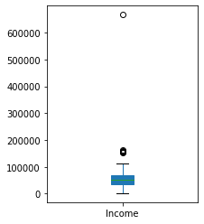
    


```python
sns.distplot(df['Income'],bins=100)
```

    c:\users\yashb\miniconda3\lib\site-packages\seaborn\distributions.py:2557: FutureWarning: `distplot` is a deprecated function and will be removed in a future version. Please adapt your code to use either `displot` (a figure-level function with similar flexibility) or `histplot` (an axes-level function for histograms).
      warnings.warn(msg, FutureWarning)
    


    <AxesSubplot:xlabel='Income', ylabel='Density'>


    
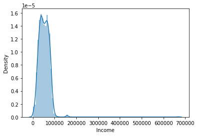
    


```python
# select columns to plot
df_to_plot = df.drop(columns=['ID', 'AcceptedCmp1', 'AcceptedCmp2', 'AcceptedCmp3', 'AcceptedCmp4', 'AcceptedCmp5', 'Response', 'Complain']).select_dtypes(include=np.number)

# subplots
df_to_plot.plot(subplots=True, layout=(4,4), kind='box', figsize=(12,14), patch_artist=True)
plt.subplots_adjust(wspace=0.5);
```


    
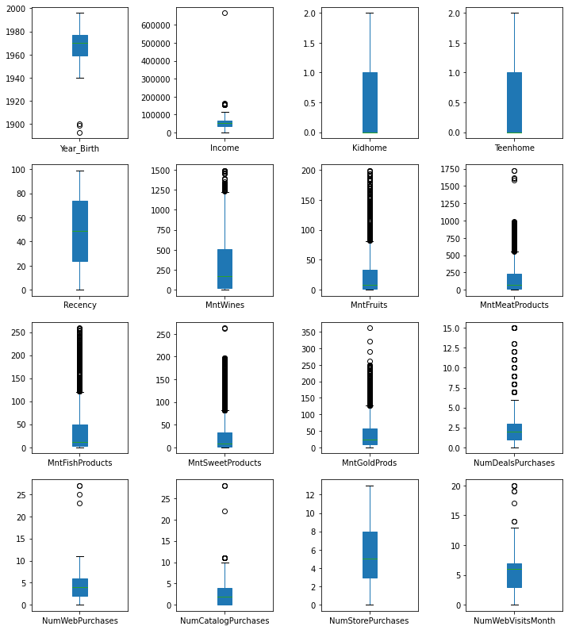
    


```python
# year < 1900 remove
df = df[df['Year_Birth'] > 1900].reset_index(drop=True)

plt.figure(figsize=(3,4))
df['Year_Birth'].plot(kind='box', patch_artist=True);
```


    
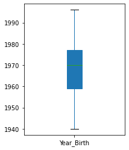
    


```python

```

Imputing median because we have outliers in the dataset


```python
df['Income'] = df['Income'].fillna(df['Income'].median())
```

The Custome Imputations Technique 


```python
df.Education.unique()
```


    array(['Graduation', 'PhD', '2n Cycle', 'Master', 'Basic'], dtype=object)


```python
df[df['Education'] == 'Graduation']['Income'].mean()
```


    52720.37365591398


```python
df[df['Education'] == 'PhD']['Income'].mean()
```


    56145.31392931393


```python
df[df['Education'] == 'Master']['Income'].mean()
```


    52917.53424657534


```python
df[df['Education'] == '2n Cycle']['Income'].mean()
```


    47633.19


```python
def impute_income(cols):
    
    Income = cols[0]
    Edu = cols[1]
    
    if pd.isnull(Income):
        if Edu == 'Graduation':
            return 5272037.3
        elif Edu == 'PhD':
            return 5614531.3
        elif Edu == 'Master':
            return 5291753.42
        elif Edu == '2n Cycle':
            return 4763319.0
    else:
        return Income
               
```


```python
df['IntIncome'] = df[['IntIncome','Education']].apply(impute_income,axis=1)
```


```python
df['Income'].isnull().sum()
```


```python

```

### EDA


```python
sns.set(rc={'figure.figsize':(14,8.27)})
```


```python
sns.countplot(x='Marital_Status',data=df)
```


    <AxesSubplot:xlabel='Marital_Status', ylabel='count'>


    
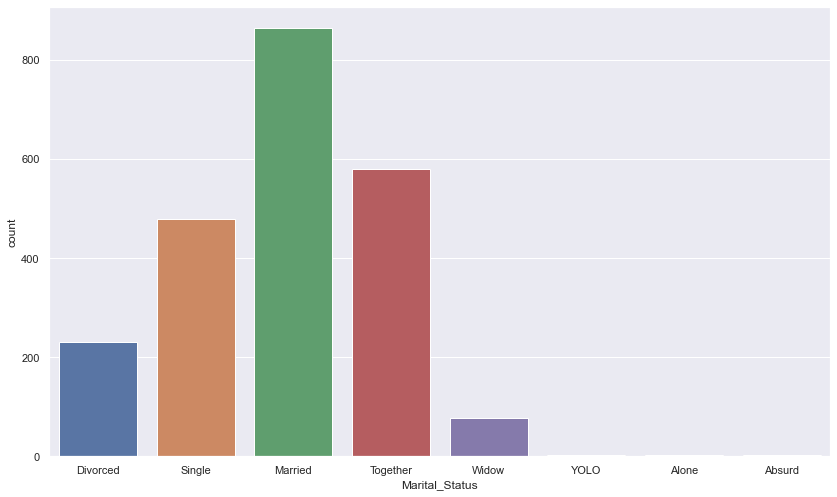
    


```python
sns.countplot(x='Marital_Status',data=df, hue='Country')
```


    <AxesSubplot:xlabel='Marital_Status', ylabel='count'>


    
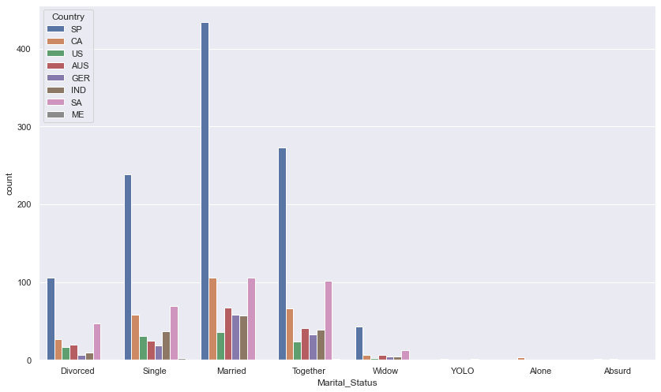
    


```python
sns.countplot(x='Marital_Status',data=df, hue='Education')
```


    <AxesSubplot:xlabel='Marital_Status', ylabel='count'>


    
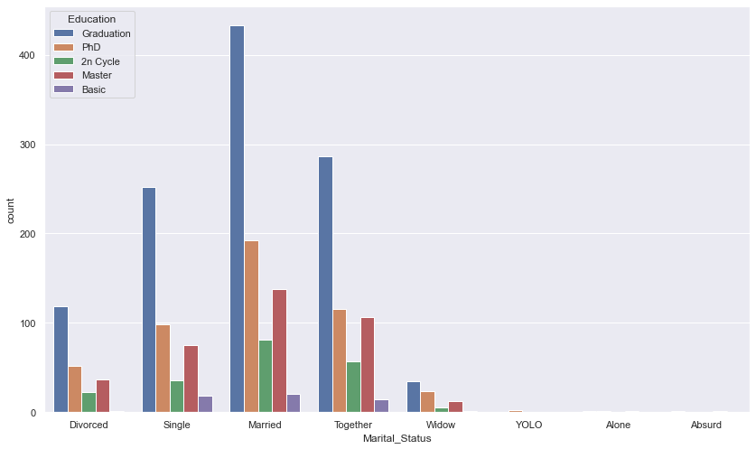
    


```python
df.head()
```


<div>
<style scoped>
    .dataframe tbody tr th:only-of-type {
        vertical-align: middle;
    }

    .dataframe tbody tr th {
        vertical-align: top;
    }

    .dataframe thead th {
        text-align: right;
    }
</style>
<table border="1" class="dataframe">
  <thead>
    <tr style="text-align: right;">
      <th></th>
      <th>ID</th>
      <th>Year_Birth</th>
      <th>Education</th>
      <th>Marital_Status</th>
      <th>Income</th>
      <th>Kidhome</th>
      <th>Teenhome</th>
      <th>Dt_Customer</th>
      <th>Recency</th>
      <th>MntWines</th>
      <th>...</th>
      <th>NumStorePurchases</th>
      <th>NumWebVisitsMonth</th>
      <th>AcceptedCmp3</th>
      <th>AcceptedCmp4</th>
      <th>AcceptedCmp5</th>
      <th>AcceptedCmp1</th>
      <th>AcceptedCmp2</th>
      <th>Response</th>
      <th>Complain</th>
      <th>Country</th>
    </tr>
  </thead>
  <tbody>
    <tr>
      <th>0</th>
      <td>1826</td>
      <td>1970</td>
      <td>Graduation</td>
      <td>Divorced</td>
      <td>84835.0</td>
      <td>0</td>
      <td>0</td>
      <td>6/16/14</td>
      <td>0</td>
      <td>189</td>
      <td>...</td>
      <td>6</td>
      <td>1</td>
      <td>0</td>
      <td>0</td>
      <td>0</td>
      <td>0</td>
      <td>0</td>
      <td>1</td>
      <td>0</td>
      <td>SP</td>
    </tr>
    <tr>
      <th>1</th>
      <td>1</td>
      <td>1961</td>
      <td>Graduation</td>
      <td>Single</td>
      <td>57091.0</td>
      <td>0</td>
      <td>0</td>
      <td>6/15/14</td>
      <td>0</td>
      <td>464</td>
      <td>...</td>
      <td>7</td>
      <td>5</td>
      <td>0</td>
      <td>0</td>
      <td>0</td>
      <td>0</td>
      <td>1</td>
      <td>1</td>
      <td>0</td>
      <td>CA</td>
    </tr>
    <tr>
      <th>2</th>
      <td>10476</td>
      <td>1958</td>
      <td>Graduation</td>
      <td>Married</td>
      <td>67267.0</td>
      <td>0</td>
      <td>1</td>
      <td>5/13/14</td>
      <td>0</td>
      <td>134</td>
      <td>...</td>
      <td>5</td>
      <td>2</td>
      <td>0</td>
      <td>0</td>
      <td>0</td>
      <td>0</td>
      <td>0</td>
      <td>0</td>
      <td>0</td>
      <td>US</td>
    </tr>
    <tr>
      <th>3</th>
      <td>1386</td>
      <td>1967</td>
      <td>Graduation</td>
      <td>Together</td>
      <td>32474.0</td>
      <td>1</td>
      <td>1</td>
      <td>5/11/14</td>
      <td>0</td>
      <td>10</td>
      <td>...</td>
      <td>2</td>
      <td>7</td>
      <td>0</td>
      <td>0</td>
      <td>0</td>
      <td>0</td>
      <td>0</td>
      <td>0</td>
      <td>0</td>
      <td>AUS</td>
    </tr>
    <tr>
      <th>4</th>
      <td>5371</td>
      <td>1989</td>
      <td>Graduation</td>
      <td>Single</td>
      <td>21474.0</td>
      <td>1</td>
      <td>0</td>
      <td>4/8/14</td>
      <td>0</td>
      <td>6</td>
      <td>...</td>
      <td>2</td>
      <td>7</td>
      <td>1</td>
      <td>0</td>
      <td>0</td>
      <td>0</td>
      <td>0</td>
      <td>1</td>
      <td>0</td>
      <td>SP</td>
    </tr>
  </tbody>
</table>
<p>5 rows × 28 columns</p>
</div>


```python
sns.catplot(x='Marital_Status',data=df, col='AcceptedCmp1',kind='count')
```


    <seaborn.axisgrid.FacetGrid at 0x29a10d46dc0>


    
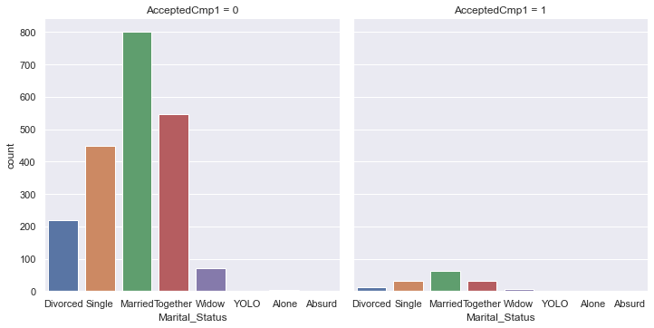
    


```python
sns.catplot(x='Marital_Status',data=df, hue='Education', col='AcceptedCmp5',kind='count')
```


    <seaborn.axisgrid.FacetGrid at 0x29a10d46370>


    
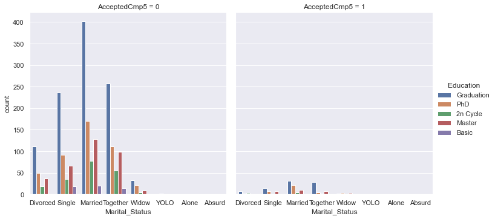
    


```python
sns.countplot(x='Complain',data=df)
```


    <AxesSubplot:xlabel='Complain', ylabel='count'>


    
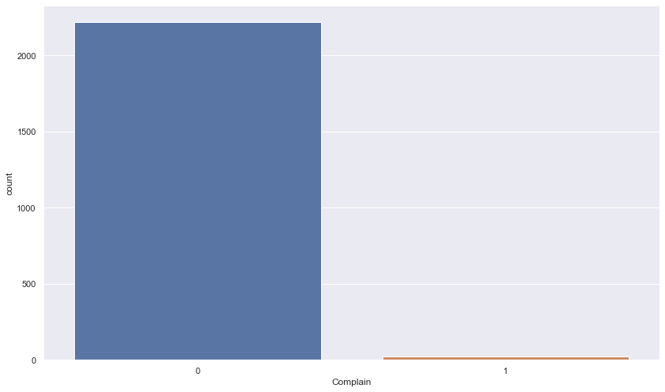
    


```python
sns.stripplot(y='MntWines',x='Country',data=df)
```


    <AxesSubplot:xlabel='Country', ylabel='MntWines'>


    
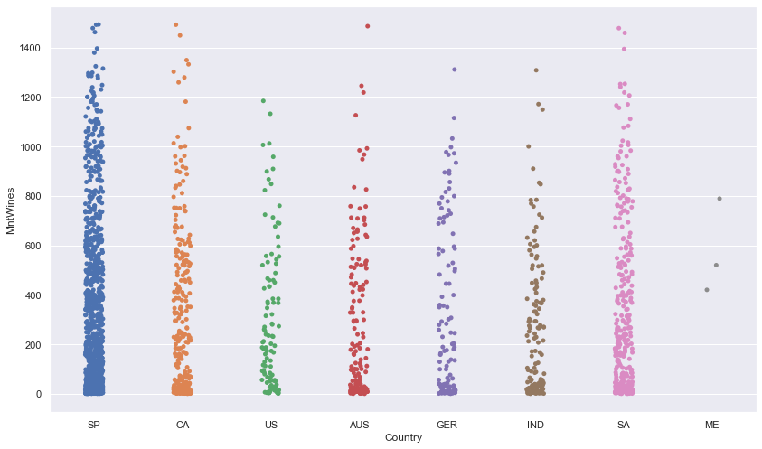
    


Some Data Transformations and Feature Engineering


```python
df.info()
```

    <class 'pandas.core.frame.DataFrame'>
    RangeIndex: 2237 entries, 0 to 2236
    Data columns (total 28 columns):
     #   Column               Non-Null Count  Dtype  
    ---  ------               --------------  -----  
     0   ID                   2237 non-null   int64  
     1   Year_Birth           2237 non-null   int64  
     2   Education            2237 non-null   object 
     3   Marital_Status       2237 non-null   object 
     4   Income               2213 non-null   float64
     5   Kidhome              2237 non-null   int64  
     6   Teenhome             2237 non-null   int64  
     7   Dt_Customer          2237 non-null   object 
     8   Recency              2237 non-null   int64  
     9   MntWines             2237 non-null   int64  
     10  MntFruits            2237 non-null   int64  
     11  MntMeatProducts      2237 non-null   int64  
     12  MntFishProducts      2237 non-null   int64  
     13  MntSweetProducts     2237 non-null   int64  
     14  MntGoldProds         2237 non-null   int64  
     15  NumDealsPurchases    2237 non-null   int64  
     16  NumWebPurchases      2237 non-null   int64  
     17  NumCatalogPurchases  2237 non-null   int64  
     18  NumStorePurchases    2237 non-null   int64  
     19  NumWebVisitsMonth    2237 non-null   int64  
     20  AcceptedCmp3         2237 non-null   int64  
     21  AcceptedCmp4         2237 non-null   int64  
     22  AcceptedCmp5         2237 non-null   int64  
     23  AcceptedCmp1         2237 non-null   int64  
     24  AcceptedCmp2         2237 non-null   int64  
     25  Response             2237 non-null   int64  
     26  Complain             2237 non-null   int64  
     27  Country              2237 non-null   object 
    dtypes: float64(1), int64(23), object(4)
    memory usage: 489.5+ KB
    


```python
df['Dt_Customer'] = pd.to_datetime(df['Dt_Customer'])
```


```python
# Dependents
df['Dependents'] = df['Kidhome'] + df['Teenhome']

# Year becoming a Customer
df['Year_Customer'] = pd.DatetimeIndex(df['Dt_Customer']).year

# Total Amount Spent
mnt_cols = [col for col in df.columns if 'Mnt' in col]
df['TotalMnt'] = df[mnt_cols].sum(axis=1)

# Total Purchases
purchases_cols = [col for col in df.columns if 'Purchases' in col]
df['TotalPurchases'] = df[purchases_cols].sum(axis=1)

# Total Campaigns Accepted
campaigns_cols = [col for col in df.columns if 'Cmp' in col] + ['Response'] # 'Response' is for the latest campaign
df['TotalCampaignsAcc'] = df[campaigns_cols].sum(axis=1)

# view new features, by customer ID
df[['ID', 'Dependents', 'Year_Customer', 'TotalMnt', 'TotalPurchases', 'TotalCampaignsAcc']].head()
```


<div>
<style scoped>
    .dataframe tbody tr th:only-of-type {
        vertical-align: middle;
    }

    .dataframe tbody tr th {
        vertical-align: top;
    }

    .dataframe thead th {
        text-align: right;
    }
</style>
<table border="1" class="dataframe">
  <thead>
    <tr style="text-align: right;">
      <th></th>
      <th>ID</th>
      <th>Dependents</th>
      <th>Year_Customer</th>
      <th>TotalMnt</th>
      <th>TotalPurchases</th>
      <th>TotalCampaignsAcc</th>
    </tr>
  </thead>
  <tbody>
    <tr>
      <th>0</th>
      <td>1826</td>
      <td>0</td>
      <td>2014</td>
      <td>1190</td>
      <td>15</td>
      <td>1</td>
    </tr>
    <tr>
      <th>1</th>
      <td>1</td>
      <td>0</td>
      <td>2014</td>
      <td>577</td>
      <td>18</td>
      <td>2</td>
    </tr>
    <tr>
      <th>2</th>
      <td>10476</td>
      <td>1</td>
      <td>2014</td>
      <td>251</td>
      <td>11</td>
      <td>0</td>
    </tr>
    <tr>
      <th>3</th>
      <td>1386</td>
      <td>2</td>
      <td>2014</td>
      <td>11</td>
      <td>4</td>
      <td>0</td>
    </tr>
    <tr>
      <th>4</th>
      <td>5371</td>
      <td>1</td>
      <td>2014</td>
      <td>91</td>
      <td>8</td>
      <td>2</td>
    </tr>
  </tbody>
</table>
</div>


```python
sns.lmplot(x='Income', y='TotalMnt', data=df[df['Income'] < 200000]);
```


    
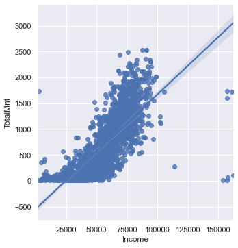
    


```python
df.corr()
```


<div>
<style scoped>
    .dataframe tbody tr th:only-of-type {
        vertical-align: middle;
    }

    .dataframe tbody tr th {
        vertical-align: top;
    }

    .dataframe thead th {
        text-align: right;
    }
</style>
<table border="1" class="dataframe">
  <thead>
    <tr style="text-align: right;">
      <th></th>
      <th>ID</th>
      <th>Year_Birth</th>
      <th>Income</th>
      <th>Kidhome</th>
      <th>Teenhome</th>
      <th>Recency</th>
      <th>MntWines</th>
      <th>MntFruits</th>
      <th>MntMeatProducts</th>
      <th>MntFishProducts</th>
      <th>...</th>
      <th>AcceptedCmp5</th>
      <th>AcceptedCmp1</th>
      <th>AcceptedCmp2</th>
      <th>Response</th>
      <th>Complain</th>
      <th>Dependents</th>
      <th>Year_Customer</th>
      <th>TotalMnt</th>
      <th>TotalPurchases</th>
      <th>TotalCampaignsAcc</th>
    </tr>
  </thead>
  <tbody>
    <tr>
      <th>ID</th>
      <td>1.000000</td>
      <td>0.003024</td>
      <td>0.013840</td>
      <td>0.002202</td>
      <td>-0.003543</td>
      <td>-0.046755</td>
      <td>-0.021181</td>
      <td>0.007080</td>
      <td>-0.002622</td>
      <td>-0.023181</td>
      <td>...</td>
      <td>-0.005062</td>
      <td>-0.021524</td>
      <td>-0.015027</td>
      <td>-0.021810</td>
      <td>0.031520</td>
      <td>-0.000989</td>
      <td>-0.007496</td>
      <td>-0.015830</td>
      <td>-0.022457</td>
      <td>-0.036025</td>
    </tr>
    <tr>
      <th>Year_Birth</th>
      <td>0.003024</td>
      <td>1.000000</td>
      <td>-0.163295</td>
      <td>0.234133</td>
      <td>-0.363350</td>
      <td>-0.019670</td>
      <td>-0.163035</td>
      <td>-0.013751</td>
      <td>-0.030927</td>
      <td>-0.042519</td>
      <td>...</td>
      <td>0.015322</td>
      <td>-0.008227</td>
      <td>-0.007657</td>
      <td>0.018424</td>
      <td>-0.004479</td>
      <td>-0.095481</td>
      <td>-0.025001</td>
      <td>-0.113865</td>
      <td>-0.179703</td>
      <td>0.007393</td>
    </tr>
    <tr>
      <th>Income</th>
      <td>0.013840</td>
      <td>-0.163295</td>
      <td>1.000000</td>
      <td>-0.428231</td>
      <td>0.019285</td>
      <td>-0.003111</td>
      <td>0.578481</td>
      <td>0.430248</td>
      <td>0.584361</td>
      <td>0.438523</td>
      <td>...</td>
      <td>0.335032</td>
      <td>0.277071</td>
      <td>0.087635</td>
      <td>0.133302</td>
      <td>-0.024902</td>
      <td>-0.292873</td>
      <td>0.022282</td>
      <td>0.667516</td>
      <td>0.567432</td>
      <td>0.287757</td>
    </tr>
    <tr>
      <th>Kidhome</th>
      <td>0.002202</td>
      <td>0.234133</td>
      <td>-0.428231</td>
      <td>1.000000</td>
      <td>-0.035753</td>
      <td>0.007544</td>
      <td>-0.496367</td>
      <td>-0.372488</td>
      <td>-0.437059</td>
      <td>-0.387536</td>
      <td>...</td>
      <td>-0.204994</td>
      <td>-0.172512</td>
      <td>-0.081794</td>
      <td>-0.080176</td>
      <td>0.036283</td>
      <td>0.690121</td>
      <td>0.053919</td>
      <td>-0.556902</td>
      <td>-0.478494</td>
      <td>-0.193287</td>
    </tr>
    <tr>
      <th>Teenhome</th>
      <td>-0.003543</td>
      <td>-0.363350</td>
      <td>0.019285</td>
      <td>-0.035753</td>
      <td>1.000000</td>
      <td>0.017115</td>
      <td>0.005409</td>
      <td>-0.175951</td>
      <td>-0.260820</td>
      <td>-0.203900</td>
      <td>...</td>
      <td>-0.190227</td>
      <td>-0.140288</td>
      <td>-0.015664</td>
      <td>-0.154730</td>
      <td>0.007591</td>
      <td>0.698558</td>
      <td>-0.008878</td>
      <td>-0.137769</td>
      <td>0.133439</td>
      <td>-0.158979</td>
    </tr>
    <tr>
      <th>Recency</th>
      <td>-0.046755</td>
      <td>-0.019670</td>
      <td>-0.003111</td>
      <td>0.007544</td>
      <td>0.017115</td>
      <td>1.000000</td>
      <td>0.016668</td>
      <td>-0.003592</td>
      <td>0.023705</td>
      <td>0.001532</td>
      <td>...</td>
      <td>0.000956</td>
      <td>-0.019258</td>
      <td>-0.001764</td>
      <td>-0.198568</td>
      <td>0.005398</td>
      <td>0.017796</td>
      <td>-0.025523</td>
      <td>0.021199</td>
      <td>0.006073</td>
      <td>-0.088749</td>
    </tr>
    <tr>
      <th>MntWines</th>
      <td>-0.021181</td>
      <td>-0.163035</td>
      <td>0.578481</td>
      <td>-0.496367</td>
      <td>0.005409</td>
      <td>0.016668</td>
      <td>1.000000</td>
      <td>0.388518</td>
      <td>0.561993</td>
      <td>0.399073</td>
      <td>...</td>
      <td>0.471969</td>
      <td>0.354365</td>
      <td>0.206040</td>
      <td>0.247392</td>
      <td>-0.035930</td>
      <td>-0.351487</td>
      <td>-0.153805</td>
      <td>0.891734</td>
      <td>0.712838</td>
      <td>0.488908</td>
    </tr>
    <tr>
      <th>MntFruits</th>
      <td>0.007080</td>
      <td>-0.013751</td>
      <td>0.430248</td>
      <td>-0.372488</td>
      <td>-0.175951</td>
      <td>-0.003592</td>
      <td>0.388518</td>
      <td>1.000000</td>
      <td>0.542057</td>
      <td>0.594438</td>
      <td>...</td>
      <td>0.212027</td>
      <td>0.195380</td>
      <td>-0.009701</td>
      <td>0.125904</td>
      <td>-0.002800</td>
      <td>-0.394122</td>
      <td>-0.054827</td>
      <td>0.613122</td>
      <td>0.456060</td>
      <td>0.172083</td>
    </tr>
    <tr>
      <th>MntMeatProducts</th>
      <td>-0.002622</td>
      <td>-0.030927</td>
      <td>0.584361</td>
      <td>-0.437059</td>
      <td>-0.260820</td>
      <td>0.023705</td>
      <td>0.561993</td>
      <td>0.542057</td>
      <td>1.000000</td>
      <td>0.567880</td>
      <td>...</td>
      <td>0.372212</td>
      <td>0.310096</td>
      <td>0.043090</td>
      <td>0.236640</td>
      <td>-0.020720</td>
      <td>-0.501814</td>
      <td>-0.082110</td>
      <td>0.842655</td>
      <td>0.554316</td>
      <td>0.329733</td>
    </tr>
    <tr>
      <th>MntFishProducts</th>
      <td>-0.023181</td>
      <td>-0.042519</td>
      <td>0.438523</td>
      <td>-0.387536</td>
      <td>-0.203900</td>
      <td>0.001532</td>
      <td>0.399073</td>
      <td>0.594438</td>
      <td>0.567880</td>
      <td>1.000000</td>
      <td>...</td>
      <td>0.198163</td>
      <td>0.260908</td>
      <td>0.002583</td>
      <td>0.111415</td>
      <td>-0.018818</td>
      <td>-0.425136</td>
      <td>-0.067306</td>
      <td>0.642395</td>
      <td>0.469374</td>
      <td>0.179535</td>
    </tr>
    <tr>
      <th>MntSweetProducts</th>
      <td>-0.006444</td>
      <td>-0.019571</td>
      <td>0.440532</td>
      <td>-0.370656</td>
      <td>-0.162218</td>
      <td>0.023045</td>
      <td>0.385992</td>
      <td>0.567054</td>
      <td>0.523418</td>
      <td>0.579553</td>
      <td>...</td>
      <td>0.258848</td>
      <td>0.241875</td>
      <td>0.009972</td>
      <td>0.117366</td>
      <td>-0.020404</td>
      <td>-0.382866</td>
      <td>-0.073002</td>
      <td>0.602701</td>
      <td>0.472681</td>
      <td>0.199077</td>
    </tr>
    <tr>
      <th>MntGoldProds</th>
      <td>-0.010661</td>
      <td>-0.057599</td>
      <td>0.325073</td>
      <td>-0.349633</td>
      <td>-0.020186</td>
      <td>0.017412</td>
      <td>0.386376</td>
      <td>0.390042</td>
      <td>0.348845</td>
      <td>0.422103</td>
      <td>...</td>
      <td>0.176382</td>
      <td>0.167145</td>
      <td>0.050252</td>
      <td>0.140693</td>
      <td>-0.029874</td>
      <td>-0.264959</td>
      <td>-0.142431</td>
      <td>0.522762</td>
      <td>0.494361</td>
      <td>0.202930</td>
    </tr>
    <tr>
      <th>NumDealsPurchases</th>
      <td>-0.036917</td>
      <td>-0.067999</td>
      <td>-0.082874</td>
      <td>0.221799</td>
      <td>0.387792</td>
      <td>-0.000987</td>
      <td>0.010829</td>
      <td>-0.131886</td>
      <td>-0.122465</td>
      <td>-0.139440</td>
      <td>...</td>
      <td>-0.182910</td>
      <td>-0.123530</td>
      <td>-0.037814</td>
      <td>0.001854</td>
      <td>0.003599</td>
      <td>0.439633</td>
      <td>-0.185942</td>
      <td>-0.065158</td>
      <td>0.361936</td>
      <td>-0.093690</td>
    </tr>
    <tr>
      <th>NumWebPurchases</th>
      <td>-0.017913</td>
      <td>-0.153973</td>
      <td>0.388183</td>
      <td>-0.362063</td>
      <td>0.155776</td>
      <td>-0.010616</td>
      <td>0.542177</td>
      <td>0.297024</td>
      <td>0.293579</td>
      <td>0.293489</td>
      <td>...</td>
      <td>0.138958</td>
      <td>0.154991</td>
      <td>0.034103</td>
      <td>0.148453</td>
      <td>-0.013233</td>
      <td>-0.146435</td>
      <td>-0.166709</td>
      <td>0.519993</td>
      <td>0.777634</td>
      <td>0.205126</td>
    </tr>
    <tr>
      <th>NumCatalogPurchases</th>
      <td>-0.001893</td>
      <td>-0.125439</td>
      <td>0.589090</td>
      <td>-0.502438</td>
      <td>-0.110285</td>
      <td>0.025449</td>
      <td>0.634784</td>
      <td>0.487307</td>
      <td>0.723519</td>
      <td>0.534033</td>
      <td>...</td>
      <td>0.321419</td>
      <td>0.308240</td>
      <td>0.099891</td>
      <td>0.220894</td>
      <td>-0.018279</td>
      <td>-0.439615</td>
      <td>-0.084918</td>
      <td>0.778375</td>
      <td>0.735272</td>
      <td>0.351386</td>
    </tr>
    <tr>
      <th>NumStorePurchases</th>
      <td>-0.014062</td>
      <td>-0.139465</td>
      <td>0.530120</td>
      <td>-0.500387</td>
      <td>0.050517</td>
      <td>0.001117</td>
      <td>0.642433</td>
      <td>0.463168</td>
      <td>0.480110</td>
      <td>0.460099</td>
      <td>...</td>
      <td>0.216147</td>
      <td>0.183043</td>
      <td>0.085098</td>
      <td>0.038855</td>
      <td>-0.011524</td>
      <td>-0.321701</td>
      <td>-0.096691</td>
      <td>0.675573</td>
      <td>0.820089</td>
      <td>0.172876</td>
    </tr>
    <tr>
      <th>NumWebVisitsMonth</th>
      <td>-0.008104</td>
      <td>0.117570</td>
      <td>-0.552736</td>
      <td>0.447641</td>
      <td>0.134491</td>
      <td>-0.021959</td>
      <td>-0.320337</td>
      <td>-0.417427</td>
      <td>-0.539203</td>
      <td>-0.445760</td>
      <td>...</td>
      <td>-0.276371</td>
      <td>-0.192948</td>
      <td>-0.007330</td>
      <td>-0.004449</td>
      <td>0.020784</td>
      <td>0.417909</td>
      <td>-0.249486</td>
      <td>-0.499922</td>
      <td>-0.313162</td>
      <td>-0.128092</td>
    </tr>
    <tr>
      <th>AcceptedCmp3</th>
      <td>-0.035959</td>
      <td>0.061013</td>
      <td>-0.016063</td>
      <td>0.014606</td>
      <td>-0.042823</td>
      <td>-0.032976</td>
      <td>0.062201</td>
      <td>0.014983</td>
      <td>0.018331</td>
      <td>0.000370</td>
      <td>...</td>
      <td>0.080930</td>
      <td>0.094661</td>
      <td>0.071981</td>
      <td>0.254144</td>
      <td>0.009916</td>
      <td>-0.020553</td>
      <td>0.011262</td>
      <td>0.053485</td>
      <td>0.020406</td>
      <td>0.428899</td>
    </tr>
    <tr>
      <th>AcceptedCmp4</th>
      <td>-0.025292</td>
      <td>-0.064341</td>
      <td>0.184615</td>
      <td>-0.161775</td>
      <td>0.038790</td>
      <td>0.018890</td>
      <td>0.373532</td>
      <td>0.010402</td>
      <td>0.103053</td>
      <td>0.016864</td>
      <td>...</td>
      <td>0.307812</td>
      <td>0.251225</td>
      <td>0.292184</td>
      <td>0.176890</td>
      <td>-0.026978</td>
      <td>-0.087743</td>
      <td>-0.011500</td>
      <td>0.253672</td>
      <td>0.189159</td>
      <td>0.539108</td>
    </tr>
    <tr>
      <th>AcceptedCmp5</th>
      <td>-0.005062</td>
      <td>0.015322</td>
      <td>0.335032</td>
      <td>-0.204994</td>
      <td>-0.190227</td>
      <td>0.000956</td>
      <td>0.471969</td>
      <td>0.212027</td>
      <td>0.372212</td>
      <td>0.198163</td>
      <td>...</td>
      <td>1.000000</td>
      <td>0.404616</td>
      <td>0.222333</td>
      <td>0.328182</td>
      <td>-0.008216</td>
      <td>-0.284533</td>
      <td>0.021442</td>
      <td>0.468505</td>
      <td>0.218197</td>
      <td>0.676892</td>
    </tr>
    <tr>
      <th>AcceptedCmp1</th>
      <td>-0.021524</td>
      <td>-0.008227</td>
      <td>0.277071</td>
      <td>-0.172512</td>
      <td>-0.140288</td>
      <td>-0.019258</td>
      <td>0.354365</td>
      <td>0.195380</td>
      <td>0.310096</td>
      <td>0.260908</td>
      <td>...</td>
      <td>0.404616</td>
      <td>1.000000</td>
      <td>0.175283</td>
      <td>0.293882</td>
      <td>-0.024913</td>
      <td>-0.225111</td>
      <td>0.037276</td>
      <td>0.382080</td>
      <td>0.219916</td>
      <td>0.635202</td>
    </tr>
    <tr>
      <th>AcceptedCmp2</th>
      <td>-0.015027</td>
      <td>-0.007657</td>
      <td>0.087635</td>
      <td>-0.081794</td>
      <td>-0.015664</td>
      <td>-0.001764</td>
      <td>0.206040</td>
      <td>-0.009701</td>
      <td>0.043090</td>
      <td>0.002583</td>
      <td>...</td>
      <td>0.222333</td>
      <td>0.175283</td>
      <td>1.000000</td>
      <td>0.169249</td>
      <td>-0.011074</td>
      <td>-0.069908</td>
      <td>0.000957</td>
      <td>0.136008</td>
      <td>0.076905</td>
      <td>0.417046</td>
    </tr>
    <tr>
      <th>Response</th>
      <td>-0.021810</td>
      <td>0.018424</td>
      <td>0.133302</td>
      <td>-0.080176</td>
      <td>-0.154730</td>
      <td>-0.198568</td>
      <td>0.247392</td>
      <td>0.125904</td>
      <td>0.236640</td>
      <td>0.111415</td>
      <td>...</td>
      <td>0.328182</td>
      <td>0.293882</td>
      <td>0.169249</td>
      <td>1.000000</td>
      <td>0.000185</td>
      <td>-0.169456</td>
      <td>-0.170877</td>
      <td>0.265726</td>
      <td>0.154794</td>
      <td>0.724757</td>
    </tr>
    <tr>
      <th>Complain</th>
      <td>0.031520</td>
      <td>-0.004479</td>
      <td>-0.024902</td>
      <td>0.036283</td>
      <td>0.007591</td>
      <td>0.005398</td>
      <td>-0.035930</td>
      <td>-0.002800</td>
      <td>-0.020720</td>
      <td>-0.018818</td>
      <td>...</td>
      <td>-0.008216</td>
      <td>-0.024913</td>
      <td>-0.011074</td>
      <td>0.000185</td>
      <td>1.000000</td>
      <td>0.031477</td>
      <td>-0.024658</td>
      <td>-0.033740</td>
      <td>-0.015727</td>
      <td>-0.015677</td>
    </tr>
    <tr>
      <th>Dependents</th>
      <td>-0.000989</td>
      <td>-0.095481</td>
      <td>-0.292873</td>
      <td>0.690121</td>
      <td>0.698558</td>
      <td>0.017796</td>
      <td>-0.351487</td>
      <td>-0.394122</td>
      <td>-0.501814</td>
      <td>-0.425136</td>
      <td>...</td>
      <td>-0.284533</td>
      <td>-0.225111</td>
      <td>-0.069908</td>
      <td>-0.169456</td>
      <td>0.031477</td>
      <td>1.000000</td>
      <td>0.032178</td>
      <td>-0.498514</td>
      <td>-0.245976</td>
      <td>-0.253522</td>
    </tr>
    <tr>
      <th>Year_Customer</th>
      <td>-0.007496</td>
      <td>-0.025001</td>
      <td>0.022282</td>
      <td>0.053919</td>
      <td>-0.008878</td>
      <td>-0.025523</td>
      <td>-0.153805</td>
      <td>-0.054827</td>
      <td>-0.082110</td>
      <td>-0.067306</td>
      <td>...</td>
      <td>0.021442</td>
      <td>0.037276</td>
      <td>0.000957</td>
      <td>-0.170877</td>
      <td>-0.024658</td>
      <td>0.032178</td>
      <td>1.000000</td>
      <td>-0.143858</td>
      <td>-0.180466</td>
      <td>-0.051842</td>
    </tr>
    <tr>
      <th>TotalMnt</th>
      <td>-0.015830</td>
      <td>-0.113865</td>
      <td>0.667516</td>
      <td>-0.556902</td>
      <td>-0.137769</td>
      <td>0.021199</td>
      <td>0.891734</td>
      <td>0.613122</td>
      <td>0.842655</td>
      <td>0.642395</td>
      <td>...</td>
      <td>0.468505</td>
      <td>0.382080</td>
      <td>0.136008</td>
      <td>0.265726</td>
      <td>-0.033740</td>
      <td>-0.498514</td>
      <td>-0.143858</td>
      <td>1.000000</td>
      <td>0.754390</td>
      <td>0.455918</td>
    </tr>
    <tr>
      <th>TotalPurchases</th>
      <td>-0.022457</td>
      <td>-0.179703</td>
      <td>0.567432</td>
      <td>-0.478494</td>
      <td>0.133439</td>
      <td>0.006073</td>
      <td>0.712838</td>
      <td>0.456060</td>
      <td>0.554316</td>
      <td>0.469374</td>
      <td>...</td>
      <td>0.218197</td>
      <td>0.219916</td>
      <td>0.076905</td>
      <td>0.154794</td>
      <td>-0.015727</td>
      <td>-0.245976</td>
      <td>-0.180466</td>
      <td>0.754390</td>
      <td>1.000000</td>
      <td>0.257708</td>
    </tr>
    <tr>
      <th>TotalCampaignsAcc</th>
      <td>-0.036025</td>
      <td>0.007393</td>
      <td>0.287757</td>
      <td>-0.193287</td>
      <td>-0.158979</td>
      <td>-0.088749</td>
      <td>0.488908</td>
      <td>0.172083</td>
      <td>0.329733</td>
      <td>0.179535</td>
      <td>...</td>
      <td>0.676892</td>
      <td>0.635202</td>
      <td>0.417046</td>
      <td>0.724757</td>
      <td>-0.015677</td>
      <td>-0.253522</td>
      <td>-0.051842</td>
      <td>0.455918</td>
      <td>0.257708</td>
      <td>1.000000</td>
    </tr>
  </tbody>
</table>
<p>29 rows × 29 columns</p>
</div>


```python
sns.heatmap(df.corr())
```


    <AxesSubplot:>


    
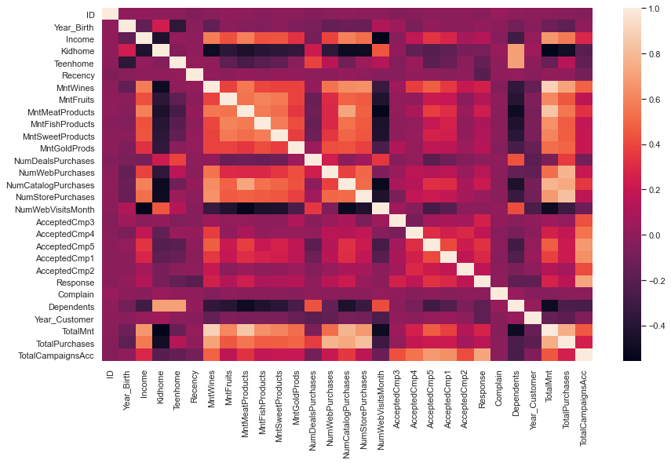
    


```python
sns.boxplot(x='Dependents',y='TotalMnt',data=df)
```


    <AxesSubplot:xlabel='Dependents', ylabel='TotalMnt'>


    
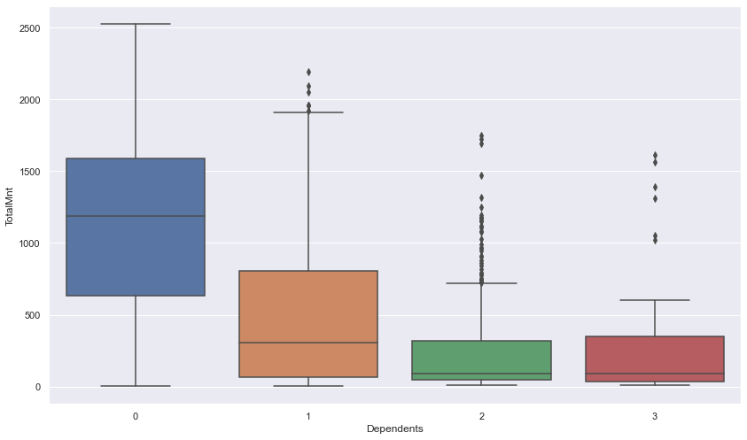
    


```python
sns.boxplot(x='Dependents',y='NumDealsPurchases',data=df)
```


    <AxesSubplot:xlabel='Dependents', ylabel='NumDealsPurchases'>


    
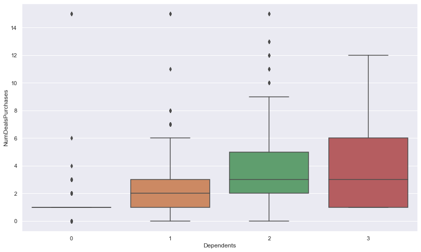
    


```python
sns.boxplot(x='TotalCampaignsAcc',y='Income',data=df)
```


    <AxesSubplot:xlabel='TotalCampaignsAcc', ylabel='Income'>


    
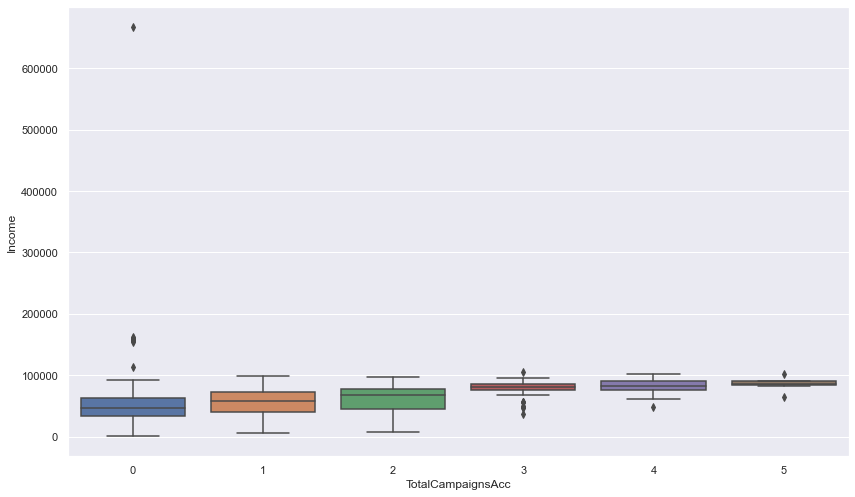
    


```python
sns.boxplot(x='TotalCampaignsAcc',y='Dependents',data=df)
```


    <AxesSubplot:xlabel='TotalCampaignsAcc', ylabel='Dependents'>


    
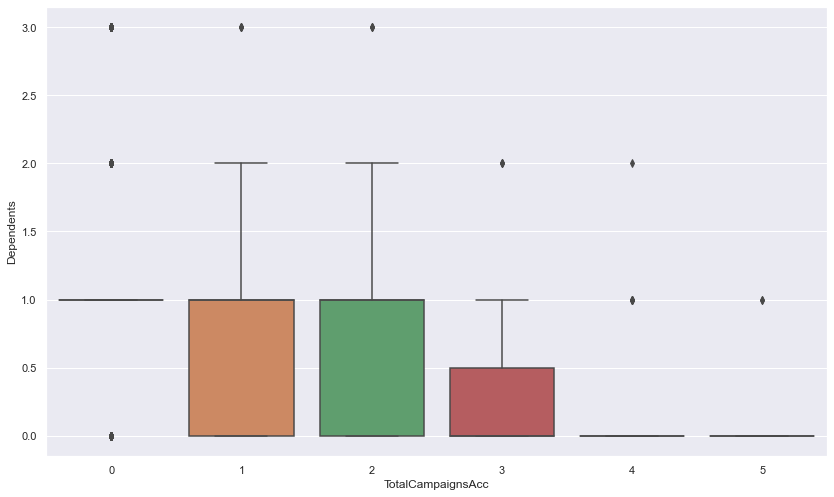
    


```python
sns.lmplot(x='NumWebVisitsMonth', y='NumWebPurchases', data=df)
```


    <seaborn.axisgrid.FacetGrid at 0x29a124de9d0>


    
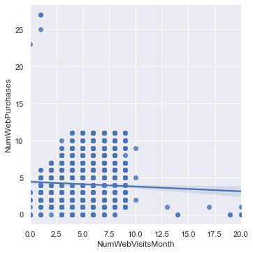
    


```python
sns.lmplot(x='NumWebVisitsMonth', y='NumDealsPurchases', data=df)
```


    <seaborn.axisgrid.FacetGrid at 0x29a120e2a60>


    
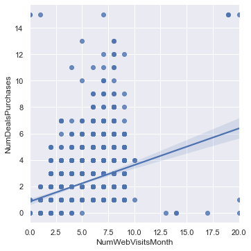
    


```python

```
